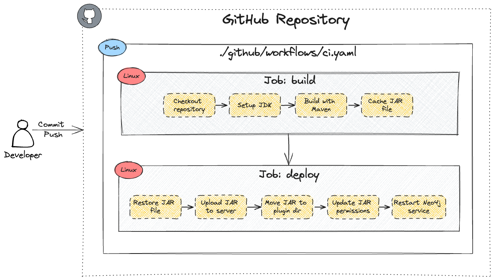

[](https://github.com/zirkelc/nodes-2023/actions/workflows/main.yml)
# Streamline Your Development With GitHub Actions: Build, Test, and Deploy Custom Neo4j Code

This repository contains the code for my talk at [Neo4j NODES 2023](https://neo4j.registration.goldcast.io/events/6fb85147-ca27-4310-9dec-cb345c53bd6f) on Octobe 26, 2023.

You can find the slides for the talk at [zirkelc.dev/nodes-2023](https://zirkel.dev/nodes-2023).

## Outline
> In this session for developers and data engineers working with Neo4j, you'll discover how GitHub Actions can streamline your development process for custom procedures and functions. Chris will show you how to create a GitHub Actions workflow that runs on every commit and push to your GitHub repository, enabling you to automate the build, testing, and deployment of your latest changes. You'll also learn how to speed up your integration process by using GitHub Actions to automatically deploy your Java plugin to your remote server, without any manual steps.

## Prerequisites
The following prerequisites are required to follow along with the demo:
- GitHub account
- JDK 11 installed on your local machine
- [Neo4j Desktop](https://neo4j.com/download/) running on your local machine
- [Neo4j Enterprise Edition v4.4.x](https://neo4j.com/deployment-center/#enterprise) running on a remote server
- SSH access to your remote server

## Custom Procedures and Functions
The code in this repository is a copy of the official [Neo4j Procedure Template](https://github.com/neo4j-examples/neo4j-procedure-template/tree/4.4) repository. For simplicity, the code has been reduced to only include the `example.join()` user defined function. 

The function `example.join()` joins a list of strings using a delimiter. 

```cypher
RETURN example.join(['A','quick','brown','fox'], ' ') as sentence
```

See [`Join.java`](src/main/java/example/Join.java) and [`JoinTest`](src/test/java/example/JoinTest.java) for the implementation.

## Manual Steps
This section describes the manual steps required to build, test, and deploy the code to your Neo4j database.
### Build and Test
The project uses [Maven](https://maven.apache.org/). Run the following command to build and test the code:

```sh
mvn clean package
```

This will create a JAR file `example-1.0.0-SNAPSHOT.jar` in the `target` folder. This JAR file can be uploaded to your remote server and installed as a plugin.

### Deploy
There are a few steps required to deploy the plugin to your remote server. The following steps assume that you have SSH access to your remote server running the Neo4j database.

Upload the JAR file to your remote server with the `scp` command.

```sh
# scp -i <ssh-key.pem> <source-file> <remote-user@remote-ip-address:target-folder>
scp -i my-ssh-key.pem target/example-1.0.0-SNAPSHOT.jar ec2-user@3.79.222.196:.
```

Login to your remote server with the `ssh` command.

```sh
# ssh -i <ssh-key.pem> <remote-user@remote-ip-address>
ssh -i my-ssh-key.pem ec2-user@3.79.222.196
```

Move the JAR file to the Neo4j plugins `/var/lib/neo4j/plugins` folder.

```sh
# sudo mv <source-file> <target-folder>
sudo mv example-1.0.0-SNAPSHOT.jar /var/lib/neo4j/plugins
```

Change the owner and group of the JAR file to `neo4j`.

```sh
# sudo chown <owner>:<group> <file>
sudo chown neo4j:neo4j /var/lib/neo4j/plugins/example-1.0.0-SNAPSHOT.jar
```

Make the JAR file executable.

```sh
# sudo chmod +x <file>
sudo chmod +x /var/lib/neo4j/plugins/example-1.0.0-SNAPSHOT.jar
```

Allow the JAR file to be loaded by adding it to the `dbms.security.procedures.allowlist` in the Neo4j configuration file `/etc/neo4j/neo4j.conf`. See [Securing Extensions](https://neo4j.com/docs/operations-manual/4.4/security/securing-extensions/#allow-listing) for more information.

```sh
# Search for `dbms.security.procedures.allowlist` and add `example.*` to the list, for example:
# dbms.security.procedures.allowlist=apoc.*,example.*
sudo nano /etc/neo4j/neo4j.conf
```

Restart the Neo4j service.

```sh
sudo systemctl restart neo4j
```

### Usage
Verify that the plugin has been installed by running the following query in the Neo4j Browser.

```cypher
SHOW FUNCTIONS WHERE name STARTS WITH "example"
```

The `example.join()` function should be listed in the results.

Run the following query to test the function.

```cypher
RETURN example.join(["Hello", "World"], " ") as sentence
```

## Automate with GitHub Actions
The following sections describe how to automate the build, test, and deploy process with GitHub Actions. The complete workflow is defined in the [`.github/workflows/ci.yml`](.github/workflows/ci.yml) file.



### About [GitHub Actions](https://docs.github.com/en/actions/learn-github-actions/understanding-github-actions)
> GitHub Actions is a continuous integration and continuous delivery (CI/CD) platform that allows you to automate your build, test, and deployment pipeline. You can create workflows that build and test every pull request to your repository, or deploy merged pull requests to production.

### Trigger
The workflow is triggered when a commit is pushed to the `main` branch.

```yaml
on:
  push:
    branches: [ main ]
```

### Variables
The following [environment variables](https://docs.github.com/en/actions/learn-github-actions/variables#defining-environment-variables-for-a-single-workflow) are defined in the workflow file and can be accessed with the `${{ env.VARIABLE_NAME }}` syntax.

```yaml
env:
  PLUGIN_JAR: "example-1.0.0-SNAPSHOT.jar"
  PLUGIN_DIR: "/var/lib/neo4j/plugins"
```

### Secrets
The following [secrets](https://docs.github.com/en/actions/security-guides/using-secrets-in-github-actions) are defined in the repository settings and can be accessed with the `${{ secrets.SECRET_NAME }}` syntax. The repository contains the three secrets `REMOTE_HOST`, `REMOTE_USER`, and `REMOTE_SSH_KEY` to access the remote server.

### Jobs
The workflow contains two jobs: `build` and `deploy`. The `deploy` job depends on the `build` job, which means the jobs run in sequence. Both jobs run on the `ubuntu-latest` virtual machine. 

#### Build
The `build` job builds and tests the code with Maven and creates a JAR file. This JAR file is saved as an [artifact](https://docs.github.com/en/actions/guides/storing-workflow-data-as-artifacts) and can be downloaded from the following `deploy` job.

#### Deploy
The `deploy` job downloads the JAR file from the `build` job and uploads it to the remote server with `scp`. The JAR file is then moved to the Neo4j plugins folder, the owner and group are changed to `neo4j`, and the file is made executable. Finally, the Neo4j service is restarted.